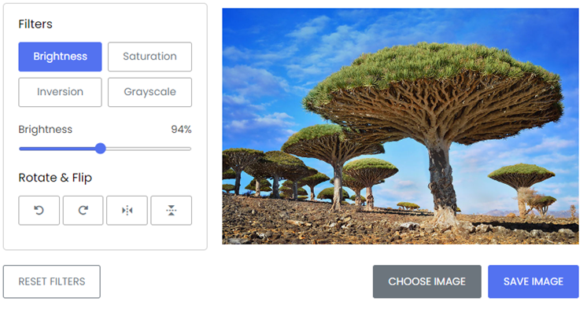
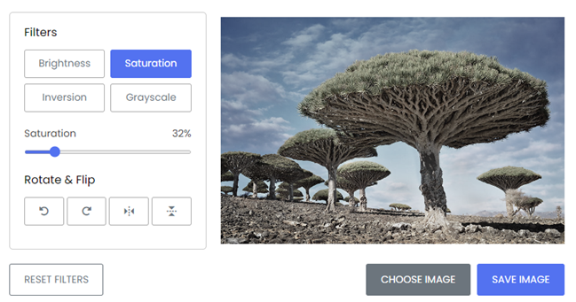
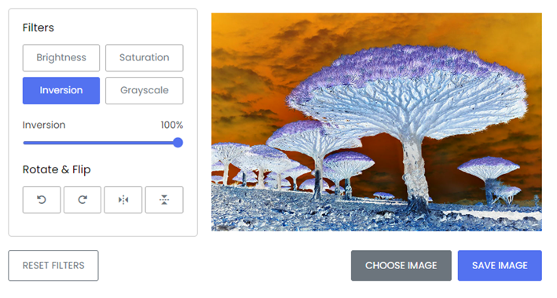
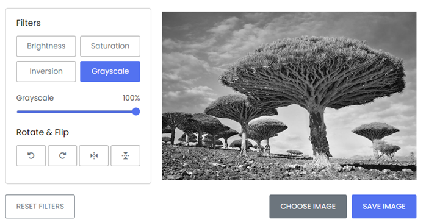
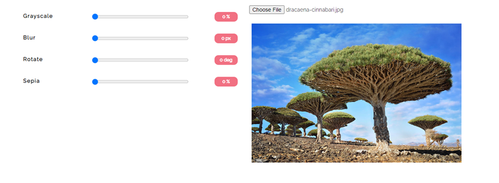
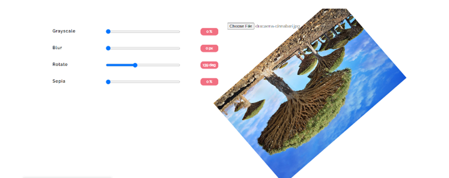
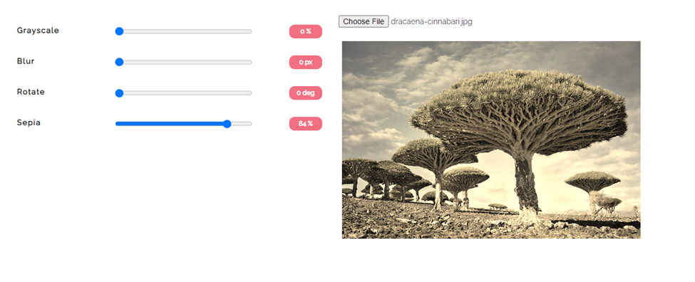
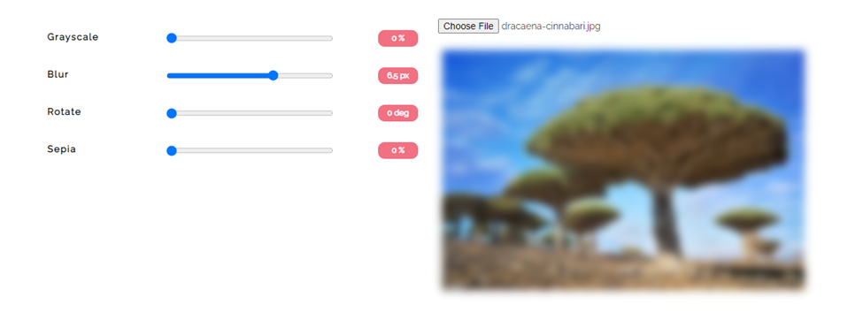

Part A- Add functionality of JS for  the given buttons 
Choose Image -Select an image and place it on the canvas
Save Image:Save image to disk
Reset Filter : Remove all filters and convert image into original form.
Brightness

Saturation

Inversion

Grayscale

Part B -Modify the Rotate and Flip buttons in a way below:
Add more button : Blur ,Rotate(360) ,Sepia, Flip
Example are given as below

